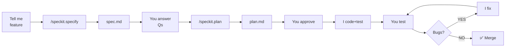

# .specify — Index

## Workflow



## Templates

| File | For |
|------|-----|
| `spec-template.md` | Spec (business) |
| `plan-template.md` | Plan (tech) |
| `quick-bug.md` | Quick fix |
| `medium-feature.md` | 2-3 day feature |

## Commands

- `/speckit.specify "description"` → create spec
- `/speckit.plan` → create plan (after spec approved)
- `/speckit.clarify "question"` → more questions

## Key Rules

- **spec.md** = Business problem, user scenarios, success criteria. NO TECH.
- **plan.md** = Tech stack, phases, files, risks, architecture decisions. NO USER STORIES.
- **Code** = TDD always (tests RED → GREEN)
- **Tests** = All 828+ must pass before any merge
- **Bug fixes** = Add regression test when you fix something

## Git Pattern

```bash
git checkout -b NNN-TYPE-title
git commit -m "spec(NNN): ..."
git commit -m "plan(NNN): ..."
git commit -m "feat(NNN): ..."  # or fix(NNN):
```

## Reference

- Constitution: `.specify/memory/constitution.md`
- Quick ref: `QUICK_REFERENCE.md` (print this)
- Project guidelines: `AGENTS.md`

---

**Status**: Ready. Just run `/speckit.specify "your feature"` and go.
