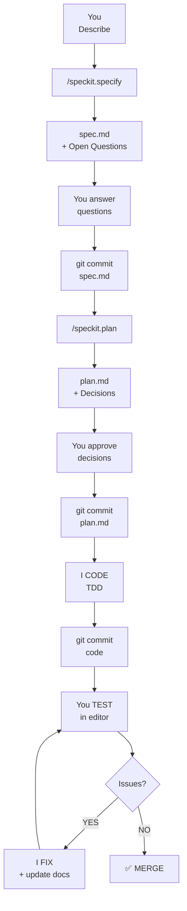

# Quick Reference

## The Workflow



## Phase Breakdown

| Phase | What | Time | Files |
|-------|------|------|-------|
| 1️⃣ Spec | I generate business spec with open questions | 10-30m | spec.md |
| 2️⃣ Plan | I generate tech plan with architecture decisions | 20-40m | plan.md |
| 3️⃣ Code | I TDD: tests RED → code GREEN → all 828 pass | 1-4h | src/*, tests/* |
| 4️⃣ Test | You test in editor, report bugs | varies | spec/plan updates |

## Git Commands

```bash
# Create branch
git checkout -b NNN-TYPE-title

# After each phase
git commit -m "spec(NNN): ..." 
git commit -m "plan(NNN): ..."
git commit -m "feat(NNN): ..."
git commit -m "fix(NNN): ..."
```

## Checklists

**Before Code**: 
- [ ] spec.md approved (all questions answered)
- [ ] plan.md approved (all decisions confirmed)

**Before Merge**:
- [ ] npm test (all 828+ pass)
- [ ] No critical issues found
- [ ] spec/plan updated with learnings

## Quick Links

- Templates: `.specify/templates/`
- Constitution: `.specify/memory/constitution.md`
- Project guidelines: `AGENTS.md`


