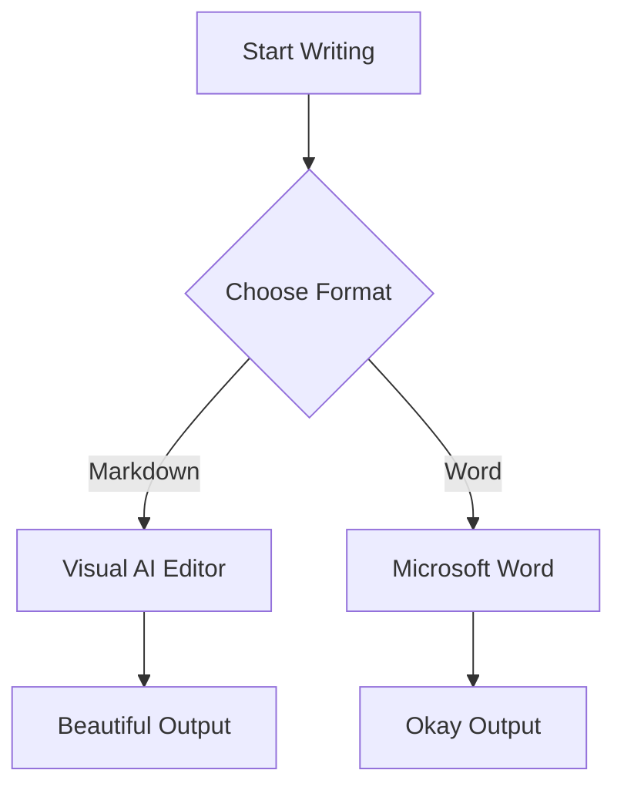

# Visual AI Markdown Editor — Feature Guide

A premium WYSIWYG markdown editing experience inside VS Code. Write naturally, focus on content — not syntax.


---

## Editor Core


- **WYSIWYG editing** — Live rendered markdown as you type, no split panes needed
- **Distraction-free writing** — Serif typography (Charter/Georgia), generous spacing
- **Auto-formatting** — Type `# ` for headings, `- ` for lists, `> ` for blockquotes, ````` for code blocks, `[]` for task lists
- **Undo / Redo** — Full history (100 levels) with Cmd/Ctrl+Z and Cmd/Ctrl+Shift+Z
- **Emoji insertion** — Insert emoji from the toolbar or right-click context menu

---

## Text Formatting

All of these formatting styles render live in the editor:


| Action                 | Result                   | Shortcut / Access    |
| ---------------------- | ------------------------ | -------------------- |
| **Bold**               | **Bold text**            | Cmd/Ctrl+B           |
| *Italic*               | *Italic text*            | Cmd/Ctrl+I           |
| Underline              | ++Underlined text++      | Cmd/Ctrl+U           |
| ~~Strikethrough~~      | ~~Struck through~~       | Toolbar              |
| `Inline code`          | `monospaced snippet`     | Toolbar              |
| <mark>Highlight</mark> | <mark>Highlighted</mark> | Toolbar              |
| Text color             | 8 preset colors          | Toolbar color picker |
| Clear formatting       | Remove all marks         | Toolbar              |


### Floating Selection Toolbar

Select any text to see a context-aware formatting bar with: Bold, Italic, Highlight, Text Color, Strikethrough, Inline Code, Heading controls, and Link insertion.

### Header Formatting Toolbar

A persistent toolbar at the top of the editor with the same formatting options, plus dropdown menus:

- **Blocks** — Blockquote, GitHub Alerts (horizontal icon row), Remove alert
- **Insert** — Link, Image, Emoji, Code Blocks (Plain/TypeScript/Python/JSON), Diagrams (Mermaid)

- [ ] **Table** — Full table management (rows, columns, sort, move, export, delete)
- [x] **Export** — PDF, Word (DOCX)
  - [ ] **View** — Toggle outline, Source view, Copy as Markdown, Configuration, Zoom
  - [ ] Sample Text
- **Help (?)** — About dialog with version info, documentation links, issue reporting, and community discussions
- **Theme toggle (☀/🌙)** — Switch between light and dark editor themes

---

## Headings

# Heading 1

## Heading 2

### Heading 3

#### Heading 4

##### Heading 5

###### Heading 6

- Full visual styling for H1–H6
- Heading dropdown in toolbar (Paragraph, H1–H6)
- Auto-created via markdown syntax (`# `, `## `, etc.)

---

## Lists

- Bullet lists with nesting:
  - Second level
    - Third level
- Ordered lists:
  1. First item
  2. Second item
  3. Third item
- Task / checkbox lists:
  - [ ] Completed task
  - [ ] Pending task
- Nested indentation with **Tab** / **Shift+Tab**
- Checkbox toggling by clicking

---

## Blockquotes

> Blockquotes are fully supported with visual styling. Insert via the **Blocks** dropdown in the toolbar or type `> ` at the start of a line.

> Nested blockquotes work too:
> > Second level quote
> > > Third level quote

---

## Tables


Here's a live example — this table is fully editable in the editor:


| Feature           | Description                                         | Access                |
| ----------------- | --------------------------------------------------- | --------------------- |
| Visual editing    | Click into cells to edit, Tab/Shift+Tab to navigate | Click                 |
| Drag-to-resize    | Grab column borders and drag to resize              | Drag                  |
| Add rows/columns  | Before or after current position                    | Right-click / Toolbar |
| Move rows         | Move row up or down                                 | Right-click / Toolbar |
| Move columns      | Move column left or right                           | Right-click / Toolbar |
| Sort by column    | Sort ascending (A→Z) or descending (Z→A)            | Right-click / Toolbar |
| CSV export        | Export any table to CSV format                      | Right-click / Toolbar |
| Delete row/column | Remove individual rows or columns                   | Right-click / Toolbar |
| Delete table      | Remove the entire table                             | Right-click / Toolbar |


### Table Toolbar Dropdown

The Table dropdown in the header toolbar provides full management:


| Section | Actions                                                     |
| ------- | ----------------------------------------------------------- |
| Insert  | Insert table (default 3×2)                                  |
| Rows    | Add before, Add after, Move up, Move down, Delete row       |
| Columns | Add before, Add after, Move left, Move right, Delete column |
| Export  | Export table as CSV                                         |
| Sort    | Sort ascending (A→Z), Sort descending (Z→A)                 |
| Delete  | Delete table                                                |


---

## Images


- **Drag & drop** from desktop or VS Code Explorer directly into the editor
- **Toolbar insert** — Insert image via the Insert dropdown menu
- **In-place resizing** — Drag corner handles to adjust width with live preview
- **Image renaming** — Change filename without leaving the editor (updates disk + markdown)
- **Auto-size warnings** — Prompted when images are oversized (helpful for Git repos)
- **Image metadata overlay** — View dimensions, file size, and path
- **Original backup** — Always backed up before resizing
- **Skip resize warning** — `gptAiMarkdownEditor.imageResize.skipWarning` to resize without confirmation


### Image Storage Modes

Configure where images are saved via `gptAiMarkdownEditor.mediaPathBase`:


| Mode                 | Example                                         | Best for                    |
| -------------------- | ----------------------------------------------- | --------------------------- |
| `sameNameFolder`     | `my-doc/image.png` next to `my-doc.md`          | Most projects (recommended) |
| `relativeToDocument` | `media/image.png` relative to the markdown file | Shared media folders        |
| `workspaceFolder`    | `media/image.png` relative to workspace root    | Monorepo setups             |


---

## Links

Links work in three modes — here's a live demonstration:

- **URL link:** [Visual Studio Code](https://code.visualstudio.com)
- **File link:** [README.md](README.md)
- **Heading anchor:** [Jump to Tables section](#tables)

### Link Features


| Feature                | How                                                     |
| ---------------------- | ------------------------------------------------------- |
| Insert / edit link     | Cmd/Ctrl+K opens the link dialog                        |
| Click to edit          | Click any link to open the edit dialog                  |
| Ctrl/Cmd+click to open | Opens external URLs, scrolls to anchors, opens files    |
| Three modes            | URL, File search (with autocomplete), Heading search    |
| Auto-populated text    | Selecting a file or heading auto-fills the display text |
| File browser           | Browse button opens VS Code file picker                 |


---

## Table of Contents


- **Always-visible sidebar** — Outline pane on the right side of the editor
- **Heading navigation** — Click any heading to jump to it
- **Active heading indicator** — Highlights current section while you scroll
- **Configurable depth** — `gptAiMarkdownEditor.tocMaxDepth` (default: 3, range: 1–6)
- **Filter headings** — Command Palette → "Filter Headings" to search by text

---

## In-Document Search

- **Cmd/Ctrl+F** — Opens search overlay
- **Match counter** — Shows current match position and total count
- **Navigation** — Arrow buttons or Enter/Shift+Enter to move between matches
- **Highlights** — All matches highlighted, active match emphasized
- **Esc to close**

---

## Highlight Syntax

Choose how <mark>highlighted text</mark> is saved to markdown via `gptAiMarkdownEditor.highlightSyntax`:


| Style              | Markdown Syntax     | Best for                       |
| ------------------ | ------------------- | ------------------------------ |
| Obsidian (default) | `==text==`          | Obsidian vault compatibility   |
| GitHub             | `<mark>text</mark>` | GitHub rendering compatibility |


Both formats are loaded regardless of the setting — only the **save** format changes.

---

## Code Blocks

Syntax highlighting for 11+ languages. Insert via the **Insert** dropdown or type `````:

```javascript
function greet(name) {
  return `Hello, ${name}!`;
}
```

```python
def fibonacci(n):
    a, b = 0, 1
    for _ in range(n):
        a, b = b, a + b
    return a
```

```sql
SELECT users.name, COUNT(orders.id) AS total_orders
FROM users
LEFT JOIN orders ON users.id = orders.user_id
GROUP BY users.name;
```


**Supported languages:** JavaScript, TypeScript, Python, Bash, JSON, CSS, HTML, SQL, Java, Go, Rust, and more. Language selector available in the code block toolbar.

---

## GitHub Alerts


Insert alerts from the **Blocks** dropdown in the toolbar (horizontal icon row) or type the markdown syntax:

> [!NOTE]
> Useful information that users should know, even when skimming content.

> [!TIP]
> Helpful advice for doing things better or more easily.

> [!IMPORTANT]
> Key information users need to know to achieve their goal.

> [!WARNING]
> Urgent info that needs immediate user attention to avoid problems.

> [!CAUTION]
> Advises about risks or negative outcomes of certain actions.

---

## Horizontal Rule

Type `---`, `***`, or `___` on a blank line to insert a horizontal rule:

---

---

## Mermaid Diagrams


Live rendering of Mermaid diagram code blocks. Double-click to edit the source. Insert via the **Insert** dropdown → Diagrams.



**15 built-in templates:** Flowchart, Sequence, Gantt, Pie, Class, State, ER, Journey, Git, Mindmap, Timeline, Sankey, XY Chart, Block, Quadrant

```plaintext
Syntax error detection with inline feedback
```

- Double-click to toggle between rendered view and source editing

---

## Math (KaTeX)

Inline math: The quadratic formula is $x = \frac{-b \pm \sqrt{b^2 - 4ac}}{2a}$ — renders live in the editor.

Display math blocks:

$  
\int_{-\infty}^{\infty} e^{-x^2} dx = \sqrt{\pi}  
$

$  
\sum_{n=1}^{\infty} \frac{1}{n^2} = \frac{\pi^2}{6}  
$

---

## Copy & Paste

### Copy

- **Copy as Markdown** — Available in the View dropdown, right-click context menu, or toolbar
- **Standard Copy** — Cmd/Ctrl+C copies as HTML (browser default)

### Paste

- **HTML → Markdown** — Smart paste converts HTML clipboard to markdown equivalent
- **Image Paste** — Images from clipboard inserted and saved to media folder
- **Table Paste** — CSV and HTML table data pasted as visual tables
- **Markdown Paste** — Recognized markdown text rendered immediately
- **File Link Paste** — Drag files from VS Code Explorer to insert links

---

## Export


| Format   | Method                                                                     |
| -------- | -------------------------------------------------------------------------- |
| **PDF**  | Via Chrome/Chromium — configure path with `gptAiMarkdownEditor.chromePath` |
| **DOCX** | Microsoft Word format — via Export dropdown in toolbar                     |
| **HTML** | Full standalone HTML document                                              |
| **CSV**  | Table-only export via right-click or toolbar                               |


---

## AI Features

### AI Refine (Copilot Integration)

Select text and right-click → **Refine the selected text** to access AI-powered rewriting:


| Mode            | Effect                                                    |
| --------------- | --------------------------------------------------------- |
| **Rephrase**    | Rewrites text while preserving meaning                    |
| **Shorten**     | Makes text more concise without losing key information    |
| **More Formal** | Adjusts tone to professional / business writing           |
| **More Casual** | Adjusts tone to conversational                            |
| **Bulletize**   | Converts text into a bulleted markdown list               |
| **Summarize**   | Condenses text to 1–3 sentences                           |
| **Custom…**     | Enter your own instruction (e.g., "translate to Spanish") |


Requires GitHub Copilot extension. Uses VS Code Language Model API.

### Configurable AI Model

Choose the model used for AI refinement via `gptAiMarkdownEditor.aiModel`. All models are free with GitHub Copilot:


| Model             | Description                                         |
| ----------------- | --------------------------------------------------- |
| `gpt-4.1`         | Best quality, recommended for most tasks (default)  |
| `gpt-4.1-mini`    | Fast and capable, good balance of speed and quality |
| `gpt-4.1-nano`    | Fastest, ideal for lightweight tasks                |
| `gpt-4o`          | Strong multimodal model                             |
| `gpt-4o-mini`     | Fast and efficient                                  |
| `claude-sonnet-4` | Anthropic's balanced model                          |
| `o4-mini`         | OpenAI reasoning model, compact                     |
| `o3-mini`         | OpenAI reasoning model, compact                     |


### Chat Participant

- Invoked with `@markdown-editor` in Copilot Chat
- Provides full document context to Copilot
- Includes currently selected text when available
- Ask questions about your document, get writing suggestions

### Selection Visibility for Copilot

- The editor exposes selected text to the extension host on every selection change
- Context key `gptAiMarkdownEditor.hasSelection` is set when text is selected
- Command `gptAiMarkdownEditor.getSelectedText` returns the current selection for any extension to query

---

## Source View Toggle

Command `gptAiMarkdownEditor.toggleSource` opens the raw markdown source in a VS Code split pane alongside the WYSIWYG view. Access via the **View** dropdown → "Open source view".

---

## Customization

### Spacing


| Setting                      | Description                        | Default | Range |
| ---------------------------- | ---------------------------------- | ------- | ----- |
| `lineSpacing`                | Line height multiplier             | 1       | 1–3   |
| `paragraphSpacing`           | Paragraph gap (em)                 | 1       | 0–3   |
| `tableCellSpacing`           | Table cell vertical padding (em)   | 0.1     | 0–2   |
| `tableCellHorizontalSpacing` | Table cell horizontal padding (em) | 0.2     | 0–3   |


### Theme

`gptAiMarkdownEditor.themeOverride` — Choose `light` or `dark`. The editor uses its own color palette independent of VS Code theme.

### Editor Zoom

`gptAiMarkdownEditor.editorZoomLevel` — Zoom the editor content from 70% to 150% (default: 100%). Accessible via the **View** dropdown zoom widget ( − 100% + ) or in VS Code settings. Persisted across all documents.

### Image Resize Warning

`gptAiMarkdownEditor.imageResize.skipWarning` — When enabled, images are resized immediately without the confirmation dialog.

### HTML Comment Preservation

`gptAiMarkdownEditor.preserveHtmlComments` — When enabled, `<!-- HTML comments -->` are preserved during round-trip editing instead of being stripped. Comments appear as subtle badges in the editor.

### Developer Mode

`gptAiMarkdownEditor.developerMode` — When enabled (default: true), shows detailed error notifications and keeps diagnostic logging enabled for troubleshooting.

### All Configuration Options


| Setting                      | Type    | Default          | Description                                            |
| ---------------------------- | ------- | ---------------- | ------------------------------------------------------ |
| `mediaPath`                  | string  | `media`          | Subfolder name for saved media files                   |
| `mediaPathBase`              | enum    | `sameNameFolder` | Where media files are saved                            |
| `chromePath`                 | string  | (auto-detect)    | Chrome/Chromium path for PDF export                    |
| `imageResize.skipWarning`    | boolean | `false`          | Skip resize confirmation dialog                        |
| `lineSpacing`                | number  | `1`              | Line height multiplier (1–3)                           |
| `paragraphSpacing`           | number  | `1`              | Paragraph gap in em (0–3)                              |
| `tableCellSpacing`           | number  | `0.1`            | Table cell vertical padding in em (0–2)                |
| `tableCellHorizontalSpacing` | number  | `0.2`            | Table cell horizontal padding in em (0–3)              |
| `themeOverride`              | enum    | `light`          | Editor theme: light or dark                            |
| `tocMaxDepth`                | number  | `3`              | Max heading depth in outline (1–6)                     |
| `highlightSyntax`            | enum    | `obsidian`       | Highlight format: obsidian (`==`) or github (`<mark>`) |
| `preserveHtmlComments`       | boolean | `false`          | Preserve `<!-- -->` comments                           |
| `editorZoomLevel`            | number  | `1`              | Editor zoom (0.7–1.5)                                  |
| `aiModel`                    | enum    | `gpt-4.1`        | AI model for text refinement (8 options)               |
| `developerMode`              | boolean | `true`           | Show detailed runtime errors                           |


---

## VS Code Integration

### Commands


| Command                 | Description                                             |
| ----------------------- | ------------------------------------------------------- |
| Open File               | Open any `.md`/`.markdown` file with this editor        |
| Show Detailed Stats     | Word count, character count, reading time               |
| Toggle TOC              | Show/hide the Table of Contents sidebar                 |
| Navigate to Heading     | Jump to a heading by position                           |
| Filter Outline          | Search headings by text                                 |
| Toggle Source View      | Open raw markdown alongside WYSIWYG                     |
| Open Attachments Folder | Open the media/attachments folder in the file explorer  |
| Get Selected Text       | Returns currently selected text (for extension interop) |


### Context Menus

- Right-click `.md` files → "Open with Visual AI Markdown Editor"
- Right-click in editor → Cut, Copy, Paste, Clear Formatting, Insert Emoji, Insert Link, AI Refine
- Right-click in tables → Row/column operations, sort, move, export CSV
- Right-click images → Resize, rename, open in Finder/Explorer

### Keyboard Shortcuts


| Action           | Windows/Linux | Mac         |
| ---------------- | ------------- | ----------- |
| Bold             | Ctrl+B        | Cmd+B       |
| Italic           | Ctrl+I        | Cmd+I       |
| Underline        | Ctrl+U        | Cmd+U       |
| Save             | Ctrl+S        | Cmd+S       |
| Undo             | Ctrl+Z        | Cmd+Z       |
| Redo             | Ctrl+Shift+Z  | Cmd+Shift+Z |
| Insert/Edit Link | Ctrl+K        | Cmd+K       |
| Find             | Ctrl+F        | Cmd+F       |
| Indent           | Tab           | Tab         |
| Outdent          | Shift+Tab     | Shift+Tab   |


### File Support

- `.md` and `.markdown` files
- Untitled documents (with workspace fallback)
- Full Git diff compatibility (text-based storage)

---

## Advanced Features

- **HTML Preservation** — Unknown/arbitrary HTML tags preserved during round-trip
- **HTML Comment Preservation** — `<!-- comments -->` preserved when enabled
- **Smart Typography** — Automatic curly quotes, em-dashes, ellipses
- **Frontmatter** — YAML frontmatter recognized and preserved
- **Indented Image Support** — 4-space or tab-indented images parsed correctly
- **Space-Friendly Paths** — Image paths with spaces handled via angle-bracket encoding

---

## Performance


| Metric                | Budget                 |
| --------------------- | ---------------------- |
| Editor initialization | < 500ms                |
| Typing latency        | < 16ms                 |
| Interactions          | < 50ms                 |
| Menu/toolbar actions  | < 300ms                |
| Large documents       | 10,000+ lines smoothly |
