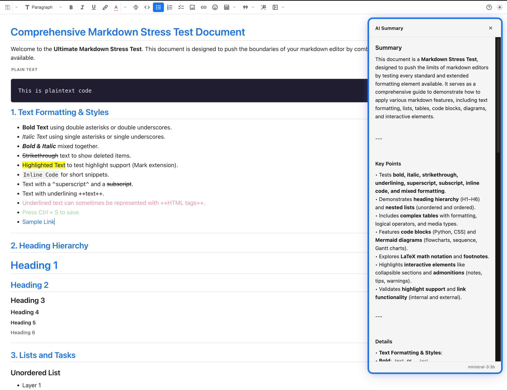

# Flux Flow Markdown Editor

**Flux Flow Markdown Editor** — The most feature-rich visual Markdown experience for VS Code, built for people who want Markdown files, not Markdown friction - formats perfectly in GitHub.

---

## Why This Editor

Most Markdown tools still make you think like a formatter instead of a writer. This editor is built to remove that friction.

You can write in a true WYSIWYG experience, edit tables visually, manage images inline, work with Mermaid diagrams, format richly, and **still keep your files as plain Markdown on disk—perfectly formatted for GitHub viewing**.

**For enterprises and teams**: The UX is closely aligned with Confluence, making it instantly familiar to Product Owners, Delivery Managers, Technical Writers, and other enterprise writing roles. If you know how to work in Confluence, you'll feel at home here—but with the benefits of decentralized Markdown files in your repository instead of vendor lock-in. This editor is in active development with weekly releases.

## Feature Highlights

### Core Editing Features

- **True WYSIWYG editing** — write directly in a formatted document without split preview panes (like Confluence, but for Markdown files)
- **Visual table editing** — resize columns, add rows and columns, and edit cells without touching pipe syntax
- **Inline image workflow** — drag in images, resize them, rename them, and inspect metadata from the editor
- **Mermaid diagram workflow** — render diagrams inline, use templates, and jump to source for editing
- **Rich formatting tools** — bold, italic, highlight, text color, headings, inline code, lists, and more
- **Advanced link creation** — create URL, file, and heading links from a guided dialog
- **GitHub-perfect Markdown output** — 100% GitHub-Flavored Markdown compatible; render perfectly on GitHub without any adjustments needed
- **Frontmatter management** — visual YAML editor with syntax highlighting and collapsible panel for document metadata

### AI &amp; Intelligence Features

- **Image vision analysis** — explain images, generate alt text, extract text from screenshots, and ask custom questions via LLM vision
- **LLM provider selection** — choose between GitHub Copilot or local Ollama for full AI feature independence and privacy
- **AI text refinement** — Rephrase, Shorten, Summarize, Bulletize, Tableize, and more with configurable language models
- **Document explanation** — automated document analysis and summarization
- **AI model selection** — choose from GPT-4.1, Claude Sonnet, o3-mini, and other models (Copilot) or any local Ollama model; Ollama supports separate text (`ollamaModel`, default `llama3.2:latest`) and image/vision (`ollamaImageModel`, default `llama3.2-vision:latest`) model settings

### Workflow &amp; Navigation

- **Document navigation** — outline sidebar, heading navigation, word count, and reading time
- **Export options** — PDF and DOCX export for sharing outside VS Code
- **Theme-aware UI** — inherits VS Code colors and works across light and dark themes
- **Extensible plugin system** — foundation for community-contributed plugins and customizations

---

## See It In Action

*A complete Markdown workflow inside VS Code: AI, visual editing, formatting, tables, images, and structured content in one seamless editor.*

---

## What Makes It Different

| Capability        | Flux Flow Markdown Editor           | Typical Markdown Extension     |
| ----------------- | ----------------------------------- | ------------------------------ |
| **Editing model** | Full WYSIWYG editor                 | Source-first with preview      |
| **Tables**        | Visual editing, resize, menus       | Manual Markdown syntax         |
| **Images**        | Drag-drop, resize, rename, metadata | File handling outside editor   |
| **Mermaid**       | Live rendering and editing workflow | Usually preview-only           |
| **Formatting**    | Toolbar plus contextual actions     | Shortcut-heavy or syntax-heavy |
| **Navigation**    | Built-in outline and document aids  | Often minimal                  |
| **Export**        | PDF and DOCX support                | Usually none or limited        |
| **Enterprise UX** | Confluence-familiar workflows       | Technical/developer focus      |

**Enterprise teams appreciate**: Product Owners, Delivery Managers, and Technical Writers familiar with Confluence find the interface instantly recognizable. No learning curve—the formatting toolbar, table editor, and document structure feel natural. But unlike Confluence, your content stays as portable Markdown files in your repository.

---

## GitHub-Perfect Output

Every document you create in Flux Flow is **100% GitHub-Flavored Markdown compatible** and renders beautifully on GitHub, GitLab, Gitea, and other Git hosting platforms—without any conversion or adjustment needed.

- **Tables render perfectly** on GitHub with proper pipe syntax
- **Images link correctly** with relative paths that work across repositories
- **Mermaid diagrams render natively** on GitHub (requires `mermaid` code fence syntax, which Flux Flow generates automatically)
- **Alerts, code fences, and formatting** follow GitHub's Markdown specification exactly
- **Frontmatter** is rendered as expected in README and documentation files
- **No proprietary markup** — your files stay as clean, portable Markdown

Write in Flux Flow, commit to GitHub, and your documents look exactly as intended. No surprises, no reformatting needed.

---

## Core Workflows

### Visual Tables

- Resize columns by dragging
- Insert and delete rows or columns from context menus
- Use toolbar controls for fast structure changes
- Navigate cells with Tab and Shift+Tab

You work on the table itself, not the Markdown syntax behind it.

### Images Without File Management Pain

- Drag and drop local images directly into the document
- Resize visually with live feedback
- Get file-size guidance for oversized assets
- Rename images from the editor and update Markdown links automatically
- Inspect dimensions, size, and path from the metadata overlay

> Original images are backed up before resize operations.

### Real WYSIWYG Markdown Writing

- Persistent formatting toolbar
- Contextual controls where you need them
- Fast switching between visual and source editing
- Markdown stays clean and portable on disk

### Links, Diagrams, Alerts, and Navigation

- Link dialog for URLs, files, and in-document headings
- Mermaid diagrams with inline rendering and templates
- GitHub-style alert blocks for notes, warnings, and tips
- Outline sidebar for heading-based navigation

## Quick Start

### Install

**VS Code Marketplace**

1. Visit [Flux Flow Markdown Editor on the Marketplace](https://marketplace.visualstudio.com/items?itemName=kamransethi.gpt-ai-markdown-editor)
2. Click **Install**

**Open VSX IDEs**

1. Open the Extensions panel in Cursor, Windsurf, VSCodium, Gitpod, Theia, or another Open VSX-compatible IDE
2. Search for `kamransethi.gpt-ai-markdown-editor`
3. Install from [Open VSX Registry](https://open-vsx.org/extension/kamransethi/gpt-ai-markdown-editor)

### Use

1. Open any `.md` file
2. Right-click and choose **Open with Flux Flow Markdown Editor**
3. Write visually and keep clean Markdown underneath

Use the `</>` toolbar button any time you want to jump to source.

### Recommended Companion Extensions

| Extension | Why |
|-----------|-----|
| [Draw.io Integration](https://marketplace.visualstudio.com/items?itemName=hediet.vscode-drawio) (`hediet.vscode-drawio`) | Double-click any embedded `.drawio.svg` image to open it in the diagram editor |
| [GitHub Copilot](https://marketplace.visualstudio.com/items?itemName=GitHub.copilot) | Powers AI text refinement, image vision analysis, and document summarization |

---

## Documentation

### For Users

- [Feature Guide](./FEATURES.md)
- [Community Guidelines](./COMMUNITY.md)
- [Report Issues](https://github.com/kamransethi/gpt-ai-markdown-editor/issues)
- [GitHub Discussions](https://github.com/kamransethi/gpt-ai-markdown-editor/discussions)
- [Security Policy](./SECURITY.md)

### For Enterprise &amp; Teams

Designed for enterprises migrating from Confluence or looking to move documentation into code repositories:

- **Confluence-Familiar UX**: The editor interface mirrors Confluence workflows, making it instantly usable for Product Owners, Delivery Managers, Technical Writers, and other non-developer roles
- **No Lock-In**: Keep your documentation as plain Markdown files in version control instead of proprietary databases
- **Export Ready**: PDF and DOCX export support for sharing and archival
- **Team Friendly**: Works seamlessly with Git workflows for collaborative editing and review cycles

See [CONTRIBUTING.md](./CONTRIBUTING.md) for team collaboration guidelines.

### For Developers

- [Contributing](./CONTRIBUTING.md)
- [Architecture](./docs/ARCHITECTURE.md)
- [Development Guide](./docs/DEVELOPMENT.md)
- [Build Guide](./docs/BUILD.md)
- [Troubleshooting](./docs/TROUBLESHOOTING.md)

### For Maintainers

- [Release Checklist](./docs/RELEASE_CHECKLIST.md)
- [QA Manual](./docs/QA_MANUAL.md)

---

## Contributing

We welcome feature ideas, bug reports, documentation fixes, and pull requests. See [CONTRIBUTING.md](./CONTRIBUTING.md) for the development workflow.

> [!NOTE]
> Note: This project is a community-maintained fork of the excellent Markdown For Humans extension from concretios. It has been extended heavily with advanced editing, media, diagramming, formatting, and workflow features while remaining open and free.

---

## License

MIT © DK-AI

---

## Credits

Built with ❤️ for Markdown lovers, by Team DK-AI