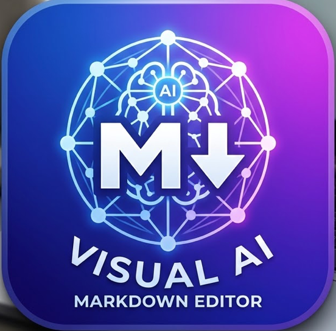

# Test Image Analysis

This document is for testing image analysis functionality.

## Test Instructions

1. Open this file in the extension
2. Right-click the image below
3. Select "Ask the image [AI]" → "Explain"
4. Monitor console output (press F12 in VS Code, check Debug Console)
5. Check the developer tools for any errors

## Test Image

## Debugging Tips

If image analysis fails, check the following in the VS Code Debug Console:

- Look for `[DK-AI] Image Ask: Received imageSrc:` to see what path was received
- Look for `[DK-AI] Image Ask: Converted to base64, length:` to see if image was loaded
- Look for `[DK-AI] Ollama: Sending request` and `[DK-AI] Ollama: Request body size:` to see what was sent
- Look for `[DK-AI] Ollama: Error response` if Ollama rejects the request

## Model Compatibility

If using Ollama, verify that your vision model actually supports images:

**Recommended vision-capable models:**
- `llava:7b` - Basic vision model
- `llava:13b` - Better quality vision model  
- `moondream:latest` - Lightweight vision model
- `llava-phi` - Fast vision model

**Models with limited/no vision support:**
- `nemotron-3-nano:4b` - May not have full vision capabilities
- Standard text models - Do not support images

You can test your model with: `ollama run <model> "Describe this image" < image.png`
