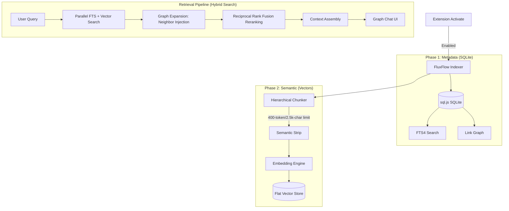

# Spec 023: FluxFlow Knowledge Graph — Foundation & Semantic Search

**Status:** ✅ Implemented  
**PRD Domains**: `knowledge-graph`  
**Date:** April 19, 2026  
**Version:** 2.2.0  
**Schema Version:** 2  
**Implementation Complexity:** Very High  

---

## 1. Quick Summary For AI Implementation

This spec defines a **Knowledge Graph** system that provides hybrid search (lexical + semantic), backlinks, and RAG-ready context for the Flux Flow Markdown Editor. 

The system indexes all `.md` files in the workspace, extracting `[[wiki-links]]`, `#tags`, and YAML properties into a SQLite database (`sql.js`). Documents are split into hierarchical chunks, cleaned of non-semantic markup, and vectorized using a local AI embedding model (via Ollama). Vectors are stored in a memory-mapped binary store.

**Core Pillars:**
1.  **Orchestration**: Full index on startup; incremental updates on save (debounced).
2.  **Lexical Engine**: SQLite (FTS4) for wiki-links, tags, and keyword search.
3.  **Semantic Engine**: Hierarchical chunking + Cosine Similarity over Float32 vectors.
4.  **Hybrid Retrieval**: 4-stage pipeline (FTS + Vector + Graph Expansion + RRF Reranking).
5.  **UI Integration**: AI Actions dropdown with "GRAPH" section and "Graph Chat" webview.

---

## 2. Configuration & Settings

The system uses native VS Code settings as the single source of truth.

| Setting | Configuration Key | Default |
|---------|-------------------|---------|
| **Enabled** | `knowledgeGraph.enabled` | `false` |
| **Model** | `knowledgeGraph.embeddingModel` | `nomic-embed-text` |
| **Endpoint** | `ollamaEndpoint` | `http://localhost:11434` |
| **Candidates** | `knowledgeGraph.rag.maxDocuments` | `8` |
| **Chunk Size** | `knowledgeGraph.rag.charsPerDoc` | `2500` |

### Settings Flow
- Extension host reads config via `vscode.workspace.getConfiguration('gptAiMarkdownEditor')`.
- Webview receives settings via `MessageType.UPDATE` or `SETTINGS_UPDATE`.
- UI visibility: `BubbleMenuView` renders Graph items only if `(window as any).knowledgeGraphEnabled` is true.

---

## 3. Architecture & Data Flow



---

## 4. Storage Components

### 4.1 SQL Database (sql.js)
Stored at `~/.fluxflow/workspaces/{hash}/graph.db`. Uses `sql.js` (WASM) for cross-platform compatibility.

**Schema (Version 2):**
```sql
CREATE TABLE documents (
  id          INTEGER PRIMARY KEY AUTOINCREMENT,
  path        TEXT    NOT NULL UNIQUE, -- Workspace-relative
  title       TEXT    NOT NULL DEFAULT '', 
  hash        TEXT    NOT NULL DEFAULT '', -- Content hash
  indexed_at  INTEGER NOT NULL DEFAULT 0
);

CREATE TABLE links (
  id           INTEGER PRIMARY KEY AUTOINCREMENT,
  source_id    INTEGER NOT NULL REFERENCES documents(id) ON DELETE CASCADE,
  target_title TEXT    NOT NULL,
  target_id    INTEGER REFERENCES documents(id) ON DELETE SET NULL,
  line_number  INTEGER NOT NULL DEFAULT 0,
  context      TEXT    NOT NULL DEFAULT '' -- 40-char window
);

CREATE TABLE chunks (
  id           INTEGER PRIMARY KEY AUTOINCREMENT,
  doc_id       INTEGER NOT NULL REFERENCES documents(id) ON DELETE CASCADE,
  header_path  TEXT    NOT NULL DEFAULT '', -- e.g. "Root > Heading 1"
  content      TEXT    NOT NULL DEFAULT '', 
  token_count  INTEGER NOT NULL DEFAULT 0
);

CREATE VIRTUAL TABLE fts USING fts4(title, body, tokenize=porter);
```

### 4.2 Vector Store (vectors.bin)
Stored at `~/.fluxflow/workspaces/{hash}/vectors.bin`. A flat binary file containing Float32 embeddings.

**Binary Format:**
- `dimensions` (4 bytes, uint32LE): Vector length.
- `count` (4 bytes, uint32LE): Total entries.
- `entries` (count * (8 + dimensions * 4) bytes):
  - `chunkId` (4 bytes, int32LE)
  - `docId` (4 bytes, int32LE)
  - `values` (dimensions * 4 bytes, float32LE)

**Dimensions Guard:** If the database reports a different dimension than the current model (e.g., 768 vs 1024), the store is automatically cleared to prevent corruption.

---

## 5. Indexing & Processing Logic

### 5.1 Document Parsing (`indexer.ts`)
1.  **Title Resolution**: Frontmatter `title` → First `# Heading` → Filename.
2.  **Wiki-links**: `[[Target]]` extracted with line number and ±40 character context.
3.  **Tags**: Inline `#tag` and frontmatter `tags: [a, b]`. Skips code fences.
4.  **Properties**: All other YAML keys stored as searchable metadata.

### 5.2 Hierarchical Chunking (`chunker.ts`)
- **Strategy**: Splits by headings `#` (H1–H3).
- **Token Heuristic**: 1 token ≈ 2.5 characters.
- **Limits**: Targets chunks <= 400 tokens or 2,500 characters.
- **Recursive Fallback**: If a section is too large, it splits by paragraphs (`\n\n`), then by lines, then by fixed character slices.
- **Context Injection**: Prepends a "Preamble" (title + top-5 properties) to every chunk so semantic meaning is preserved in isolation.

### 5.3 Semantic Cleaning (`embeddingEngine.ts`)
Before embedding, text is sanitized:
- Strip images: `` → `""`
- Collapse diagrams: ` ```mermaid ... ``` ` → `"Diagram"`
- Remove markers: `<mark>`, `<br>` → `""` or `" "`

---

## 6. Retrieval & Results

### 6.1 Hybrid Search Pipeline (`hybridSearch.ts`)
1.  **Stage 1 (Parallel)**: Fetch top-16 FTS results and top-16 Vector results (Cosine Similarity > 0.3).
2.  **Stage 2 (Expansion)**: Find documents linked to/from the top-3 results via the `links` table. Inject these document IDs into the candidate pool with a small score boost.
3.  **Stage 3 (RRF)**: Rerank all candidates using Reciprocal Rank Fusion: `score = Σ 1 / (60 + rank)`.
4.  **Stage 4 (Assembly)**: Return top-8 results with snippets and source provenance (FTS, Vector, or Graph).

### 6.2 Graph Chat UI
- **Menu Entry**: Under "AI Actions" dropdown. Contains "GRAPH" header and "Graph Chat" button.
- **Webview**: Streaming RAG interface. 
- **Theming**: Syncs with `gptAiMarkdownEditor.themeOverride`. Uses `--chat-*` CSS variables on `[data-theme="dark"]`.

---

## 7. Implementation Reliability

- **Persistence**: Database save is debounced (5s) to prevent disk thrashing during heavy typing.
- **Transactional**: Re-indexing uses `BEGIN TRANSACTION` and `COMMIT` for atomic updates.
- **WASM Management**: `sql.js` WASM file is explicitly copied to `dist/` during build and excluded from `.vscodeignore`.
