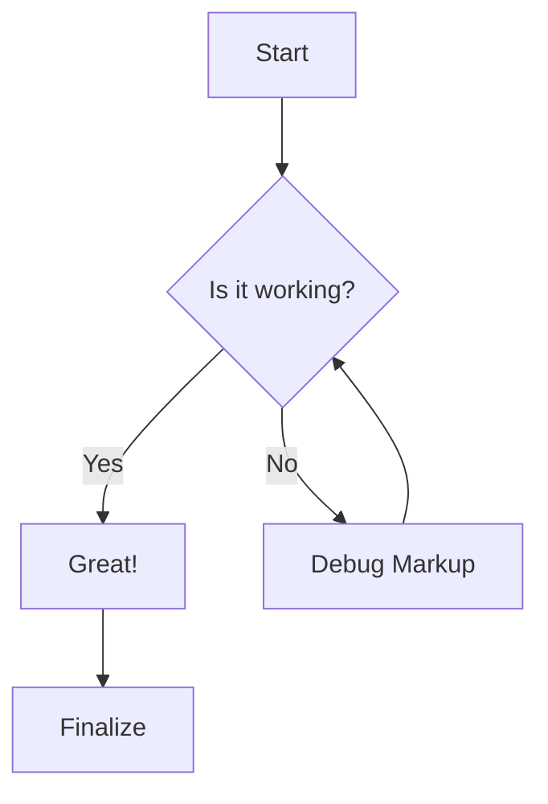
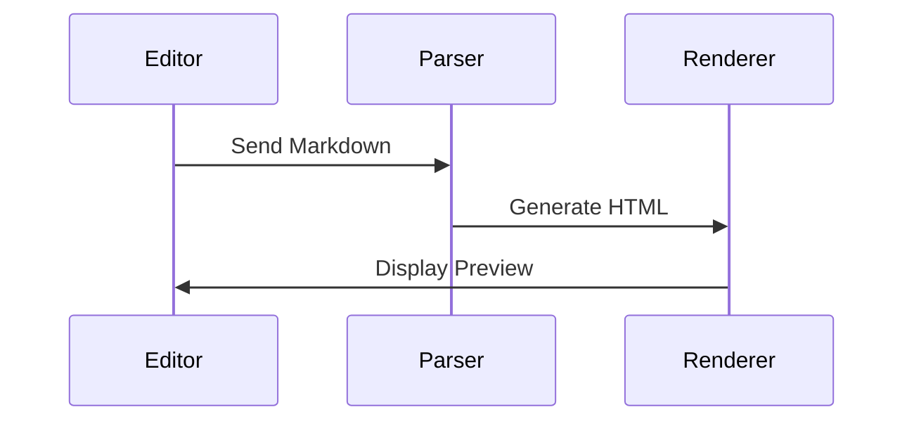
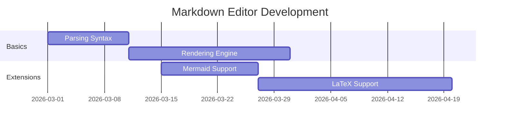

# Comprehensive Markdown Stress Test Document

Welcome to the **Ultimate Markdown Stress Test**. This document is designed to push the boundaries of your markdown editor by combining every standard and extended element available.

```plaintext
This is source code
And it saves well
```

## 1. Text Formatting &amp; Styles

- **Bold Text** using double asterisks or double underscores.
- *Italic Text* using single asterisks or single underscores.
- ***Bold &amp; Italic*** mixed together.
- ~~Strikethrough~~ text to show deleted items.
- <mark>Highlighted Text</mark> to test highlight support (Mark extension).
- `Inline Code` for short snippets.
- Text with a ^superscript^ and a ~~subscript~~.
- Text with underlining ++text++.
- <span style="color: #fff59d">Underlined text can sometimes be represented with ++HTML tags++.</span>
- <span style="color: #A5D6A7">Press Ctrl + S to save.</span>
- [Sample Link](./Test.md)


---

## 2. Heading Hierarchy

# Heading 1

## Heading 2

### Heading 3

#### Heading 4

##### Heading 5

###### Heading 6

---

## 3. Lists and Tasks

### Unordered List

- Layer 1
  - Layer 2 (indented)
    - Layer 3 (deeply nested)
- Back to Layer 1

### Ordered List with Inline Marks (Tests Bandaid #1: OrderedListMarkdownFix)

Both `1.` (dot) and `1)` (paren) styles should preserve **bold**, *italic*, `code`, [links](https://example.com).

1. First item with **bold**
2. Second item with *italic*
3. Third with ***both***
4. Item with `code` and ~~strike~~
5. Item with [link](https://example.com)
6. Nested first - **bold nested**
7. Nested second with *italic*
8. Nested third with `code`
- Back to bullets
- Another **bold** bullet
1. Ordered in bullets
2. Another ordered

Note: Parenthesis style `1)` is normalized to `1.` by TipTap, proving OrderedListMarkdownFix works.

### Task List

- Completed task
- Incomplete task
- Task with *formatting* and &lt;mark&gt;highlight&lt;/mark&gt;

---

## 4. Blockquotes

> "The only way to do great work is to love what you do."— Steve Jobs
> > This is a nested blockquote.  
> > It can go deeper if needed.

---

## Source Code

## 5. Complex Tables

This table contains cells with bullet points separated by `<br>-` elements as requested.


| Feature Type   | Description / Details    | Status |
| -------------- | ------------------------ | ------ |
| **Formatting** | - Bold<br>- Italic<br>- <mark>Highlight</mark> | ✅      |
| **Logic**      | - Logical operators<br>- Bitwise shifts<br>- Boolean algebra      | 🌀     |
| **Media**      | - Images<br>- Videos<br>- Audio files            | 🎬     |
| **Advanced**   | - Mermaid Charts<br>- LaTeX Formulas<br>- Footnotes         | 🚀     |


| Feature Type | Description / Details                                | Status |
| ------------ | ---------------------------------------------------- | ------ |
| Formatting   | - Bold- Italic- Highlight                            | ✅      |
| Logic        | - Logical operators- Bitwise shifts- Boolean algebra | 🌀     |
| Media        | - Images- Videos- Audio files                        | 🎬     |
| Advanced     | - Mermaid Charts- LaTeX Formulas- Footnotes          | 🚀     |


---

## 6. Code Blocks

### Python Example

### CSS Example

---

## 7. Media &amp; Images

Below are the generated images for aesthetic testing.

### Abstract Geometry


*Figure 2: A minimalist study in color and shape.* 

*Another Image*


---

## 8. Mermaid Diagrams

### Flowchart



### Sequence Diagram



### Gantt Chart



---

## 9. Mathematical Expressions

When $a \ne 0$, there are two solutions to ax^2 + bx + c = 0 and they are  
$x = {-b \pm \sqrt{b^2-4ac} \over 2a}$

---

## 10. Links &amp; Footnotes

- [Standard Link](https://www.google.com)
- [Reference Link][ref]
- [Internal Link](#1-text-formatting--styles)
- Automatic Link: [https://example.com](https://example.com)

Here is a sentence with a footnote reference[^1].

[^1]: This is the content of the footnote located at the bottom of the page.

---

## 11. Interactive Elements

Click to expand additional details

Inside this collapsible section, we can have more content:

- Even more lists
- `Code snippets`
- And links!

---

## 12. Admonitions (Note/Tip/Warning)

> [!NOTE]
> This is a note callout. Useful for extra information.

> [!CAUTION]
> This is a tip callout. Helps users find shortcuts.

> [!WARNING]
> Use extreme caution when editing raw markdown files!

---


| Feature Type | Description / Details | Status |
| ------------ | --------------------- | ------ |
| Formatting   | - Test Highlight      | qwewq  |
| Logic        | - Logical operators   |        |


| Heading                   | Second | Third |
| ------------------------- | ------ | ----- |
| This iis a long first row |        |       |
|                           |        |       |
|                           |        |       |
