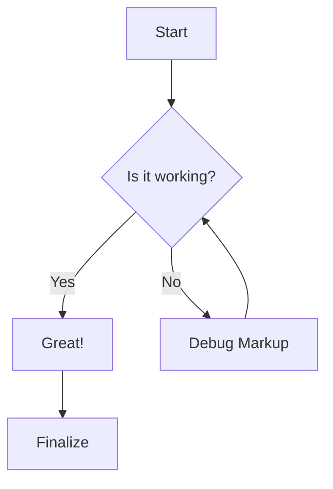
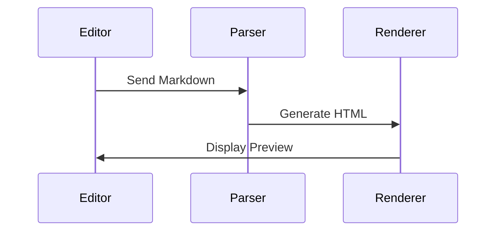
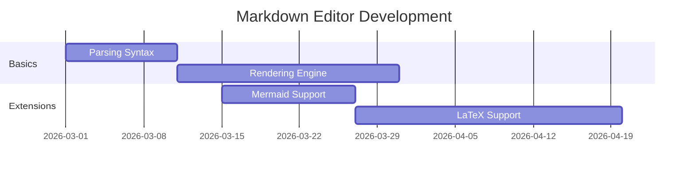

# Comprehensive Markdown Stress Test Document

Welcome to the **Ultimate Markdown Stress Test**. This document is designed to push the boundaries of your markdown editor by combining every standard and extended element available.


| 1     | 2      | 3     |
| ----- | ------ | ----- |
| qweqw | eqweqw | eqwe  |
| eqw   | qweqw  | qweqe |
| e     | qwewqe | qe    |


## 1. Text Formatting & Styles

- **Bold Text** using double asterisks or double underscores.
- *Italic Text* using single asterisks or single underscores.
- ***Bold & Italic*** mixed together.
- ~~Strikethrough~~ text to show deleted items.
- <mark>Highlighted Text</mark> to test highlight support (Mark extension).
- `Inline Code` for short snippets.
- Text with a ^superscript^ and a ~~subscript~~.
- Text with underlining ++text++.
- Underlined text can sometimes be represented with ++HTML tags++.
- Press Ctrl + S to save.
- [Sample Link](./Test.md)

---

## 2. Heading Hierarchy

# Heading 1

## Heading 2

### Heading 3

#### Heading 4

##### Heading 5

###### Heading 6

---

## 3. Lists and Tasks

### Unordered List

- Layer 1
  - Layer 2 (indented)
    - Layer 3 (deeply nested)
- Back to Layer 1

### Ordered List

1. First Item
2. Second Item
3. Sub-item A
4. Sub-item B
5. Third Item

### Task List

- [x] Completed task
- [ ] Incomplete task
- [ ] Task with *formatting* and <mark>highlight</mark>

---

## 4. Blockquotes

> "The only way to do great work is to love what you do."— Steve Jobs
> > This is a nested blockquote.  
> > It can go deeper if needed.

---

## 5. Complex Tables

This table contains cells with bullet points separated by `<br />-` elements as requested.


| Feature Type   | Description / Details    | Status |
| -------------- | ------------------------ | ------ |
| **Formatting** | - Bold<br />- Italic<br />- <mark>Highlight</mark> | ✅      |
| **Logic**      | - Logical operators<br />- Bitwise shifts<br />- Boolean algebra      | 🌀     |
| **Media**      | - Images<br />- Videos<br />- Audio files            | 🎬     |
| **Advanced**   | - Mermaid Charts<br />- LaTeX Formulas<br />- Footnotes         | 🚀     |


---

## 6. Code Blocks

### Python Example

```python
def stress_test(elements):
    """
    A function to simulate markdown processing.
    """
    for element in elements:
        print(f"Processing {element}...")
    return True

stress_test(["table", "image", "mermaid"])
```

### CSS Example

```css
.highlight-container {
    background-color: #fff3cd;
    border: 1px solid #ffeeba;
    border-radius: 4px;
    padding: 10px;
}
```

---

## 7. Media & Images

Below are the generated images for aesthetic testing.

### Futuristic Techscape


*Figure 1: A visualization of a neon-lit future city.*

### Abstract Geometry


*Figure 2: A minimalist study in color and shape.*

---

## 8. Mermaid Diagrams

### Flowchart



### Sequence Diagram



### Gantt Chart



---

## 9. Mathematical Expressions

When $a \ne 0$, there are two solutions to ax^2 + bx + c = 0 and they are  
$x = {-b \pm \sqrt{b^2-4ac} \over 2a}$

---

## 10. Links & Footnotes

- [Standard Link](https://www.google.com)
- [Reference Link][ref]
- [Internal Link](#1-text-formatting--styles)
- Automatic Link: [https://example.com](https://example.com)

Here is a sentence with a footnote reference[^1].

[^1]: This is the content of the footnote located at the bottom of the page.

---

## 11. Interactive Elements

Click to expand additional details

Inside this collapsible section, we can have more content:

- Even more lists
- `Code snippets`
- And links!

---

## 12. Admonitions (Note/Tip/Warning)

> [!NOTE]
> This is a note callout. Useful for extra information.

> [!CAUTION]
> This is a tip callout. Helps users find shortcuts.

> [!WARNING]
> Use extreme caution when editing raw markdown files!

---


| Feature Type | Description / Details | Status |
| ------------ | --------------------- | ------ |
| Formatting   | - Test Highlight      | qwewq  |
| Logic        | - Logical operators   |        |
